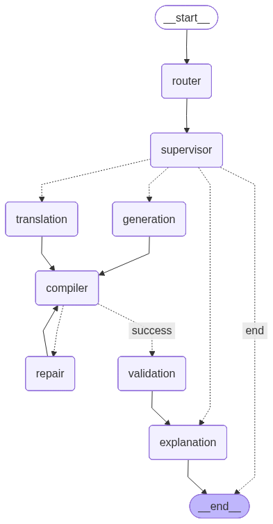

# CodeGen-Capstone-Project

An agentic code-generation and code-understanding system built with FastAPI, LangGraph, and Groq-backed LLM orchestration.

## Project Description

This repository implements an end-to-end AI coding workflow that can:

- generate code from a natural-language problem statement
- translate code between supported languages
- explain generated or translated code
- validate and repair the output through a graph-based execution loop

The system is designed as a multi-agent workflow where a router first classifies the user request, and then the supervisor coordinates downstream execution through specialized fine-tuned agents exposed as:

- `generate` agent
- `translate` agent
- `repair` agent

These agents are invoked through the orchestration layer and are responsible for the core code-generation, code-translation, and code-repair capabilities. The overall workflow then continues with compilation, validation, and explanation stages.

## Architecture Overview

The main workflow is defined in the LangGraph pipeline in `codegen_agent.py` and follows this sequence:

1. `router` classifies the request and extracts structured metadata
2. `supervisor` decides which branch to invoke
3. `generation` or `translation` creates the main code artifact
4. `compiler` runs syntax/compilation checks
5. `repair` attempts to fix failing output/failed compilation
6. `validation` scores the final code
7. `explanation` returns a plain-language explanation

The graph stores state in `state.py`, uses a request body model from `app.py`, and relies on external model/providers configured through `config.py`.



## Key Modules

- `app.py` – FastAPI service entrypoint that exposes the `/router` endpoint
- `state.py` – shared state schema and request/response models
- `router.py` – LLM-based request classifier
- `api_client.py` – client layer that calls the exposed specialized agents via `/generate`, `/translate`, and `/repair`
- `code_generator.py` – generation, translation, and repair orchestration
- `compiler_agent.py` – compilation validation for Python and Java
- `python_validation_agent.py` – Python validation logic
- `java_validation_agent.py` – Java validation logic
- `code_explanation.py` – final explanation generation
- `graph.md` – Mermaid workflow diagram

## Environment Requirements

Before running the project, make sure you have:

- Python 3.10+
- pip
- Java JDK installed and available on `PATH` for Java compilation checks
- a Groq API key

## Setup Instructions

### 1. Create and activate a virtual environment

```bash
python -m venv venv
.\venv\Scripts\Activate
```

### 2. Install dependencies

```bash
pip install -r requirements.txt
```

### 3. Configure environment variables

Create a `.env` file in the project root and set the environment variables that the app reads in [config.py](config.py):

```env
GROQ_API_KEY=your_groq_api_key_here
QWEN_BASE_MODEL=Qwen/Qwen2.5-Coder-3B-Instruct
LLAMA_BASE_MODEL=Llama-3.1-8B-Instant
FAST_API_URL=http://localhost:8000
```

Notes:

- `GROQ_API_KEY` is required by the app startup path.
- `QWEN_BASE_MODEL` defaults to `Qwen/Qwen2.5-Coder-3B-Instruct` if unset.
- `LLAMA_BASE_MODEL` defaults to `Llama-3.1-8B-Instant` if unset.
- `FAST_API_URL` defaults to `http://localhost:8000` if unset.

The project loads `.env` automatically through `load_dotenv(BASE_DIR / ".env")` in [config.py](config.py).

### 4. Verify Java tooling

The compiler step uses `javac` for Java validation. Make sure the JDK is installed and accessible.

### 5. Run the application

```bash
python app.py
```

The service will start a FastAPI server and expose the `/router` endpoint.

## API Usage

### Request example

```json
{
  "user_query": "Write Python code to find the factorial of a number.",
  "thread_id": "demo-thread-1"
}
```

### Example call

```bash
curl -X POST http://localhost:8080/router \
  -H "Content-Type: application/json" \
  -d '{
        "user_query": "Write Python code to find the factorial of a number.",
        "thread_id": "demo-thread-1"
      }'
```

## Expected Use Cases

This project is suitable for:

- code generation from natural-language requirements
- automatic code translation across Python and Java
- code explanation for learning, review, and debugging
- graph-driven LLM orchestration with validation and repair

## Notes

- The router is intentionally limited to classification and structured extraction.
- The overall workflow is graph-based rather than a single-prompt pipeline.
- The success of the workflow depends on a valid Groq API key and supporting runtime dependencies.
